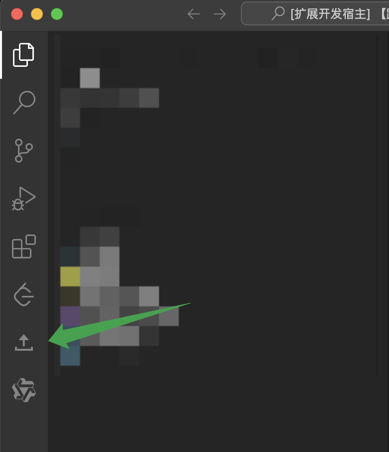
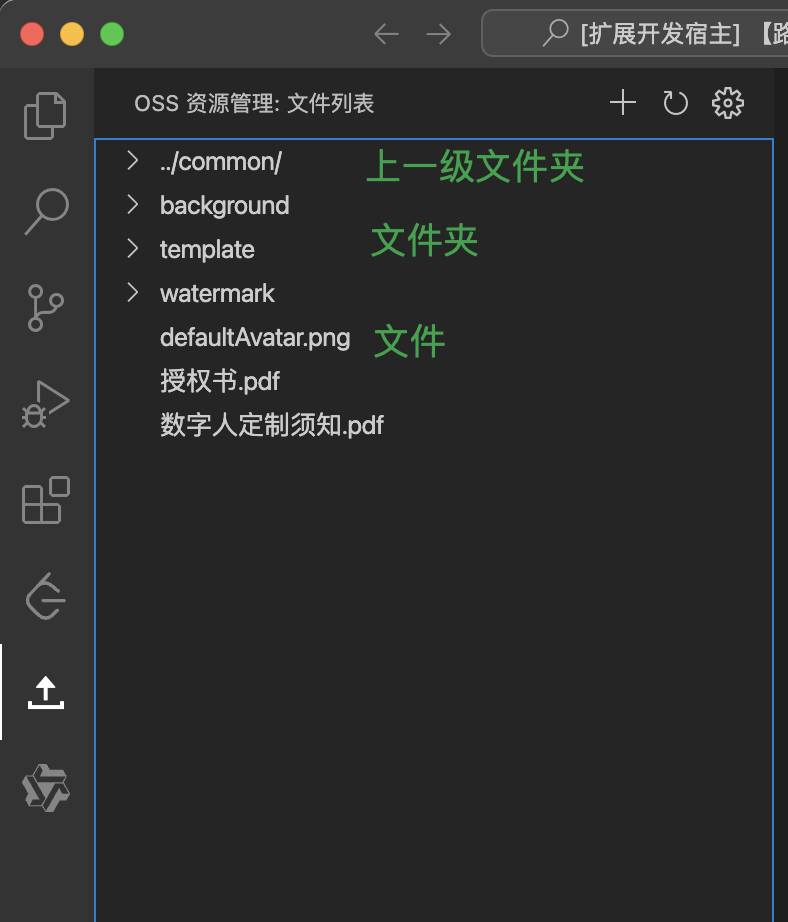

# README

`ali-oss-management` 是一款运行在 VS Code 的 OSS 资源管理插件，可以方便快捷的自定义 OSS 配置，进行上传图片、视频等静态资源，并支持预览。

## 使用方法

1. 安装插件
在 VS Code 的插件市场中搜索 `ali-oss-management`，安装即可。

2. 配置 OSS 参数
选择 VS Code 的 `File -> Preferences -> Settings`，搜索 `ali-oss-management`，配置 `accessKeyId`、`accessKeySecret`、`region`、`endpoint`、`bucket` 等参数。

> 建议将 `accessKeyId`、`accessKeySecret`、`region`、`endpoint` 四个参数配置到用户软件的私有 `Settings.json` 中，将 `bucket` 配置到项目的  `Settings.json` 的配置中。
>
> 在项目根目录下创建 `.vscode` 文件夹，在文件夹中创建 `Settings.json` 文件，配置 `bucket` 参数，配置文件示例如下：

```json
{
  "ali-oss-management.bucket": "digital-person-daily",
}
```

3. 查看文件列表

在编辑器左侧活动栏中，选择 `Ali OSS Management` 视图，即可看到 OSS 文件列表。


支持选择某文件夹，查看该文件夹内的文件


4. 上传文件

点击视图顶部的添加按钮，选择要上传的文件，即可上传到 OSS 当前目录中。


5. 预览文件
支持预览图片类型的文件，点击图片文件即可在视图中预览。

